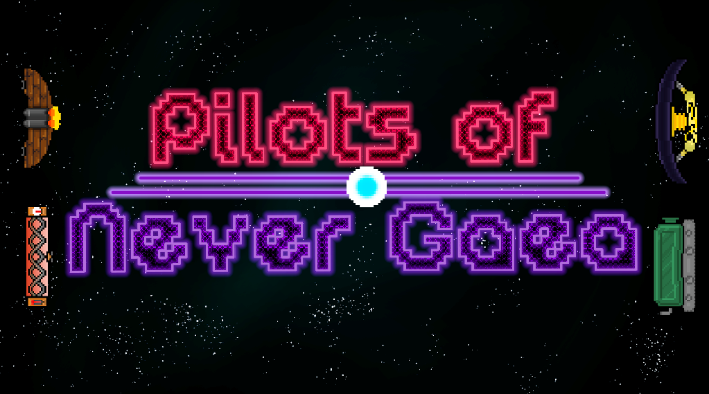

# Pilots Of Never Gaea

A new take ona classic game, now with lasers, shotguns, cannons and many more powers!

Destroy friendships and settle rivalries with a couple rounds of Pilots Of Never Gaea!

This is a game demo developed by students from <a href="https://www.imagecampus.edu.ar/">Image Campus</a>

   

## Credits

- **Julián Serulnikov Kohen** - *Programming* -   
- **Lautaro Concetti** - *Art* - 
- **Joaquín Italiano** - *Art* -
- **Alan Mandralli** - *Audio* - 
- **Cristian Florez** - *Audio* - 

This game was also possible thanks to the support of these professors:

- **Sergio Baretto**
- **Federico Barra**
- **Jorge Cuéllar**
- **Fernando Puig**
- **Eugenio Taboada**

## Acknowledgements

Bi Baubo, you know it

## Links

Download it from itch.io: https://julianserulnikovkohen.itch.io/pilots-of-never-gaea
